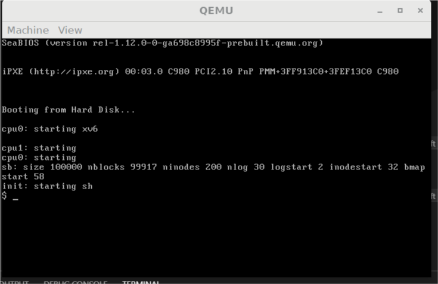

## Introduction  
  Being considered as the three romances of a programmer, An OS is both challenging and interesting project to dive in. As a mature codebase of operation system study, xv6 is a good re-implementation of Unix v6, which is used by MIT's 6.828.  This project aims at apply improvements on the a quasi-original codebase of xv6 ([xv6-improved](https://github.com/sunziping2016/xv6-improved)) , adding including new kernel features and user support so as to create a linux-like full-featured kernel, including some modern techniques, such as MLFQ scheduling and an extended file system.  
  Taking the mistakes of the 1st generation rexv6 project into consideration, the project will firstly be improved on the vital parts such as processes and memory management. Then filesystem and shell will be tweaked and a graphic framework will be finally constructed.  
  In the implement of all the features, the algorithms and data structure will be thought over discreetly and put in the first place, instead of the feature itself or the amount of the features, so as to gain great efficiency.  
## Goals  
Uncomplete and unsorted goals are listed below:  
- Lottery Scheduler
- FAT32 support  
- Signals
- File structures and make system manipulations  
- Support for various file systems and driver types  
- Separating device driver from the kernel  
- Memory management tweaks  
- Shell and GUI  
- POSIX compatibility  
## Try it out  

### What you need  
- A available Linux environment with Qemu installed.  
	The alternatives includes WSL and any other virtual PCs. I am using Debian on WSL.  
	
-  Build-essentials, or at least GNU tools such as gdb and gcc.  
	GCC 6.3.0 is being used.    

### Clone  
The project is hosted at [rexv6-2](https://github.com/SmartPolarBear/rexv6-2)   
`$ git clone https://github.com/SmartPolarBear/rexv6-2.git`

### Build  
`$ make qemu`

