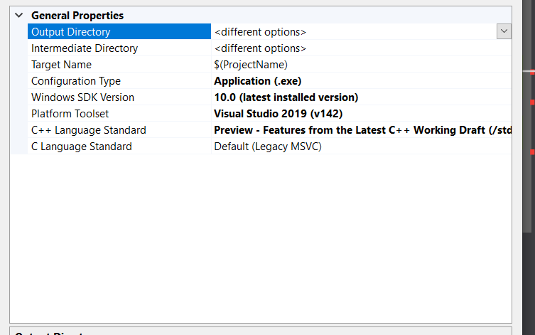
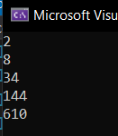

Since years before C++ 20's release, I have been keeping a close eye on it. Many new features fairly tickle my fancy, among which are ```<ranges>```  and ```<format>``` library components. While there's no available implementation for ```<format>``` yet, MSVC 16.8 and GCC-10 provides a usable  ```<ranges>``` which I played with and writes the post for.   

My life highly involved closely with programming begins with a long period using C#. Among all the language features of C#, LINQ is the beloved one for me. Enabled by LINQ, I can express complicated queries clearly and elegantly, and the performance is ensured by delaying the evaluation to when the results is used. Years after my last C# project, the smooth feeling using LINQ still remain fresh in my memory. The ranges library, now, enable I to do it similarly, which is why I dash to have a try.  

## Table of Contents  

1. [What is a Range](#id-what)  
2. [Use Ranges](#id-use)
3. [Ranges and Constrained Algorithms](#id-ca)
4. [Ranges and Range Adapters](#id-ra)
5. [Lazy Evaluation](#id-le)
6. [Ranges and Coroutines](#id-rc)
7. [Epilogue](#id-ep)
8. [Further Reading](#id-fr)  

## What is a Range? <a name="id-what"></a>  

As is mentioned in [N4128](http://www.open-std.org/jtc1/sc22/wg21/docs/papers/2014/n4128.html) , A range is a reference to a sequence of elements:  

> A range is an object that refers to a sequence of elements, conceptually similar to a pair of iterators.  

Bjarne Stroustrup, emphasized in his *Thriving in a Crowded and Changing World: C++ 2006–2020*, that :
> A range is a concept.  

A range is defined by concept as follows (from [std::ranges::range on cppreference](https://en.cppreference.com/w/cpp/ranges/range)) :  

```C++
template< class T >
concept range = requires(T& t) {
  ranges::begin(t); // equality-preserving for forward iterators
  ranges::end  (t);
};
```
The definition, given that you have known about STL containers, is quite easy to understand. Given `begin()` and `end()`, it constraints what can be iterated by an iterator and a sentinel that marks the end.  

Iterators are constantly seen especially in STL to define a sequence, which provide a uniform interface to operate or traverse the elements and support some important language features like range-based for, while they do have some inconvenience. A simple example is to traverse part of a container whose elements satisfy a certain criterion with range-based for loop. Moreover, the increasing need for a way to avoid many variables to store intermediate results while ensuring the security gives birth to the STL ```<ranges>```, which is likely to be used more widely than its `Boost.ranges` ancestor.  The ranges library defines a lot of components for dealing with ranges, commonly-used view adapters included. With its various new features and improvements, it is called "the STL 2.0".   

## Use Ranges <a name="id-use"></a>  
Enable ```<ranges>``` is relatively easy,  as a language feature of C++ 20, The only configuration needed is to set the language version to C++ 20 .
### MSVC 16.8 and Later
In MSVC, set the language standard to "Features from the Latest C++ Working Draft" (`/std:c++latest`) in project's *Properties->Configuration Properties->General* :  


### GCC-10 and Later
In GCC, simply pass ```-std=c++20``` to the compiler.  

### Implementation Status
It is worth mentioning that MSVC's implementation is quite a partial one with inferior support for range adapters, and the Intellisense does not work well from time to time. However, there are some components of coroutines that only available in MSVC, so some of the code snippets below are compiled with and only with MSVC, and others are, and maybe only are compiled with GCC-11. For details, refer to [Compiler support for C++20](https://en.cppreference.com/w/cpp/compiler_support/20), or the C++ status page of certain compiler.  

## Ranges and Constrained Algorithms <a name="id-ca"></a>  

Remeber how we use, for example, `std::sort` to sort a `vector<int>`? We always use iterators in the paradigm of *[first,one_beyond_last)* to express the elements that needs sorting, but given that we sort the whole container, is there any chance for it to be simplified? **YES!** with Ranges. As containers like a `vector` has the `begin()` and `end()` member, the container itself is a range, so with ranges following code can be write:  

```C++
vector<int> vec{3,5,2,8,10};
std::ranges::sort(vec);	
for(auto i:vec)
{
	cout<< i<<" ";
}
```
Such simpified STL algrithms are called [Constrained algorithms](https://en.cppreference.com/w/cpp/algorithm/ranges). Nearly all STL algorithms have constrained version, which not only simplified the use, but also strengthen the ability of the ranges library if used with what's discussed below.  

## Ranges and Range Adapters <a name="id-ra"></a>  

Let's begin with a relatively easy example. Now given a container of integers, the task is to get the first two even ones and get their squares. With ranges library, it's straight forward to express the task as follows:  

```C++
#include <iostream>
#include <vector>
#include <ranges>

using namespace std;
using namespace std::views;

int main()
{
	vector<int> vec{ 20,1,12,4,20,3,10,1 };

	auto even = [](const int& a)
	{
		return a % 2 == 0;
	};

	auto square = [](const int& a) {return a * a; };

	for (int i : std::views::take(std::views::transform(std::views::filter(vec, even), square), 2))
	{
		std::cout << i << endl;
	}

	return 0;
}

```
But, hey, is there any difference with traditional way to deal with containers? The prolonged and complicated nested function calling ```std::views::take(std::views::transform(std::views::filter(vec, even), square), 2)``` is the very thing that many programmers dislike to see, let along the complexity to add a new operation or change the order.  Why isn't it good to see? partly because readers should find the operands from the inner-most call and then read the parameters and recursively going out layer by layer. Constantly glancing forth and back is tiring, right?  So it's time to introduce what really pleased me of the ranges library: the pipeline operator.  

As a noticeable feature of ranges library,  the pipeline operator  ```|``` means delivering the output of its left-hand operand as the input to its right-hand operand. This enables a elegant way to express a sequence of operations for something, or somehow a functional-style programming. With the magic of it, we can turn the traditional composing syntax to the following code :

```C++
for (int i : vec | filter(even) 
			| transform([](const int& a) {return a * a; })
			| take(2))
{
	cout << i << endl;
}

```

Pretty and clear, isn't it ? the container and the operations on it are concatenated with the pipeline operator and is used by the range-based for. When reading the code, we glance the operands of the pipeline operators line by line, providing a very nature and easy way to understand the code. It is the relief of mental burden that reduces the change of producing buggy code.  

`filter()` , `transform()`, and `take()` plays an important part in the code above, which are called ***range adapters***. Range adapters take [`viewable_range`](https://en.cppreference.com/w/cpp/ranges/viewable_range)s as their parameters and can be called by the pipe operators. The standard library defined a set of range adapters ([Ranges on cppreference](https://en.cppreference.com/w/cpp/ranges)), which provide various transformation on ranges. For example, to join many containers, the code below can be simply write:  

```C++
vector<vector<int>> vec2{ {1,2},{3,4},{5,6} };
for (auto i : vec2 | std::views::join)cout << i << " ";
```
which gives the output:  
> 1 2 3 4 5 6

Also by using `std::views::join`, we can concatenate strings:

```C++
auto parts={"c"sv,"+"sv,"+"sv,"20"sv};
for (auto c : parts | std::views::join)cout << c;
```

which gives the output:  

> c++20

Moreover, we can take element from a container of tuples by using `std::views::elements` :

```C++
vector<tuple<int, int, int>> vec3{{1, 2, 3}, {4, 5, 6}, {7, 8, 9}};
for (auto e : vec3 | std::views::elements<1>)
	cout << e << endl;
```

The outputs are   
> 2  
> 5  
> 8  

With these range adapters' help, it is no longer a problem to write elegant code to operate ranges with good readability. But what concerns to C++ programmers is that, what about performance ?  

## Lazy Evaluation <a name="id-le"></a>  

C++ programmers cares about performance, so how does the `<ranges>` library ensure it? the key is lazy evaluation.  Lets take the a simple code snippet as a example.   
```C++
vector<int> vec{ 20,1,12,4,20,3,10,1 };
auto v = vec | filter(even) | transform([](const int& a) {return a * a; })| take(2)
cout << *v.begin() << endl;
```
Here the whole expression of the second line `auto v = ...`  generates a view, neither modifying what in `vec`, nor copying any elements to elsewhere and storing theme. In other words, the construct of `v` has nothing to do with the size of `vec`.  

Then we print `*v.begin()`, which is when the evaluation happens. The on-demand evaluation not only ensure that they can be used everywhere iterators can be used, but also make sure the performance with complicated transformations, for evaluation happens just when the value is used and will not happen a second time. Sounds great, isn't it? If only it can play with not only STL containers.  

## Ranges and Coroutines <a name="id-rc"></a>  

Coroutine is indeed the focus of C++ 20, which enjoys great popularity even before its release. Coroutines are, in simple words, functions that can suspend and resume. Isn't it traits give you a strong sense that it's a good couple with the ranges library, given that it has the lazy evaluation feature?  

For example, with [Coroutines (C++20)](https://en.cppreference.com/w/cpp/language/coroutines), it's easy to write a Fibonacci generator like this:   

```C++
// #include <experimental/generator> on MSVC 16.8
experimental::generator<uint64_t> fib(uint32_t n) noexcept
{
	uint64_t buf[3] = { 1,1 };

	for (uint32_t i = 0; i < n; i++)
	{
		if (i >= 2)
		{
			buf[i % 3] = buf[(i - 1) % 3] + buf[(i - 2) % 3];
		}

		co_yield buf[i % 3];
	}

	co_return;
}
```
It is surely not what we regard as a container, which all the examples above dealt with. However, remember what mentioned in the beginning that :
> A range is a concept.   

Given that a generator has `begin()` and `end()` member, it satisfies the concept and therefore cooperates well with the ranges library. The code below demonstrates how to filter even numbers from the first 15 elements of the Fibonacci sequence.  

```C++
auto fib_gen = fib(15);
auto even_fib=fib_gen | views::filter([](const int& a) {return a%2==0;});
```

And, with the help of coroutines and ranges, till now, no real evaluation happens, until we really use some of its values, like iterating through the even numbers:  

```C++
for (auto& v : even_fib)
{
	cout << v << endl;
}
```

which gives the output:  
  

## Epilogue  <a name="id-ep"></a>  
Ranges, as a important and useful library component, deserve the "STL 2.0" name, and provides a uniform way to express the concept of range and compose transformation and STL algorithms. Although the ranges are not aimed to replace iterators, they reduce the explicit use of iterators, simplifying code.  

With ranges and coroutines, more effective programs with elegant code and good code readability will be really easy to achieve, which handle IO delays and parallelism well. In the near future, [Networking TS](http://www.open-std.org/jtc1/sc22/wg21/docs/papers/2018/n4734.pdf) is going to be merged into C++23, when coroutines and ranges can be used widely by larger number of applications. For example, `const_buffer` and 	`mutable_buffer` of the *Networking TS* satisfy the `range` concept. 

## Further Reading  <a name="id-fr"></a>  

#### 1. Thriving in a Crowded and Changing World: C++ 2006–2020, Bjarne Stroustrup.    

This paper demonstrate the history of modern C++ (C++11 and later) and gives a comprehensive  view of language and library features like concepts, coroutines and ranges, as well as their history.  

#### 2.[Ranges TS](http://www.open-std.org/jtc1/sc22/wg21/docs/papers/2017/n4685.pdf) and [(Coroutines TS)](https://www.iso.org/standard/73008.html)  

Standard documents about the ranges library and coroutines.  

#### 3.[A beginner's guide to C++ Ranges and Views.](https://hannes.hauswedell.net/post/2019/11/30/range_intro/)  

Very concrete introduction to the ranges concepts and views.  