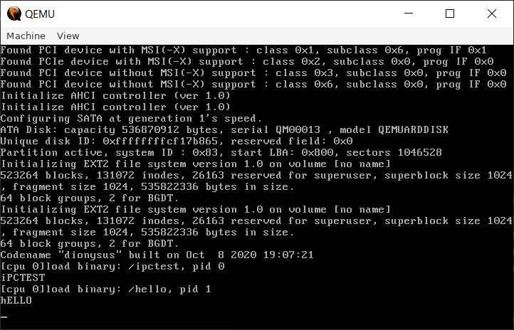

## Prologue  
&nbsp;&nbsp;&nbsp;&nbsp;Dating back to a year ago, when I was attempting to add various features to the original rexv6-2 project, I am trapped by some very tough issues. I had been ambitious about the plan, but many of them turn out to be too hard to be carried out, and some of the original code of xv6, frankly speaking, is somehow out of date. That's when it flashed on me that it may be better to build a new one from scratch. At that time, I meet the series of papers about minix3 and the concept of microkernel, and exokernel, described by a paper from MIT. They were really appealed to me. In the following months, it gradually become the main work for me, and soon turned to be the longest-lasting personal project of mine.  

## Why Operation System Kernel?  
&nbsp;&nbsp;&nbsp;&nbsp;As science and technologies advancing, all the devices are becoming powerful, bringing the concept of "Install and remove apps" everywhere, following the increasingly urgent need of reliable operation system kernels equipped with modern concepts and consensus. Among all the needs, security and reliability should be the top.  Intricate problem involved, it is impossible to keep the old routines. The new kernels recently appear in the industry, Google's zircon for example, regard the concepts of microkernel, strictly isolated processes, and the well-encapsulated resource management as the key to success in the future. As the new consensus of the industry, these concepts must be invaluable for me, a freshman planning to major computer science, to acquire proficiency in. That's the ultimate aim of project Dionysus.  

## What's the Principles of Development  
- Care about kernel itself first.  
&nbsp;&nbsp;&nbsp;&nbsp;Having learned from previous attempts and failures, In this project, grub2 is used to boot the kernel, to block away the details and tricks that are too legacy. And user applications, shells, and GUI are **not** priorities.  

- Application of data structures and algorithms  
&nbsp;&nbsp;&nbsp;&nbsp;Being more familiar with data structures and algorithms with deeper understanding, It's high time I should use it in a project and observe their pros and cons  in production.  

- Understand every details, and choose the best  
&nbsp;&nbsp;&nbsp;&nbsp;I regard this as a serious project to learn. So I shall figure out all every detail including how popular operation system do and why they do like that and choose the best means among them so as to deepen my understanding about operation system.  

## What's Going on Now?  
&nbsp;&nbsp;&nbsp;&nbsp;Despite the ultimate aim, the more advanced a concept is, the harder it is for an individual to implement. So now the job is to first build a usable kernel on the mature techniques and concepts that popular operation system kernels mostly rely on. By now, the following modules had been covered partly or completely:  
- Memory management  
- Drivers  
- Process management  
- Power management  
- File system  
- Facilities for user apps  
- Framework and libraries that all the above involved  

&nbsp;&nbsp;&nbsp;&nbsp;And they are now temporarily built into a macro kernel but are neatly divided and isolated from each other, making it possible for future changes.  
  
&nbsp;&nbsp;&nbsp;&nbsp;Because of the complexity of file system and the design of interfaces, the development has been slow recently . A rough schedule is to finishe file system by the end of 2020, and finished other kernel modules by mid-2021.  

## What's the Plan for the Future?  
  
&nbsp;&nbsp;&nbsp;&nbsp;To achieve the goal, after all the features are tested to work well, the first step is to implement a object manager to provide uniform interface and security guard for all the resource, making all the resources appears to be handles. and then the modules will be moved to separate processes running under kernel privileges.  
&nbsp;&nbsp;&nbsp;&nbsp;The reason why system servers still run under kernel privileges is to simplify the development work. And two separate sets of API provided will make it easy to port existent Linux apps like LLVM  C/C++ standard libraries and compiler kits.  
&nbsp;&nbsp;&nbsp;&nbsp;As another goal for me, a hand-made simple compiler may be implemented and used in the accomplished project, but so far there's no plan to build a kernel with custom compilers.

## Epilogue  
&nbsp;&nbsp;&nbsp;&nbsp;I remember that I have had the idea to implement a kernel very early after I learn how to code. The urge become so strong that I make the first attempt when I graduate from junior high school, when I even find it difficult to understand the difference between physical memory and virtual memory. Then I made a few attempts afterwards, slowly becoming aware of the key points of kernel and how to build a kernel. During times of try and fail, I gradually know how to work with Linux distributions and start to  fall under the spell of the philosophy of UNIX. And then I learned more, and finally became determined to write my own. I am serious, and I will try my best this time to build a usable one with everything I'd ever imagined on it.