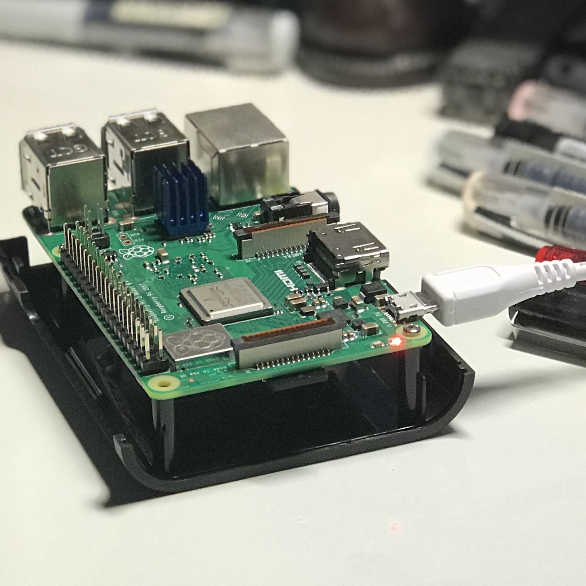
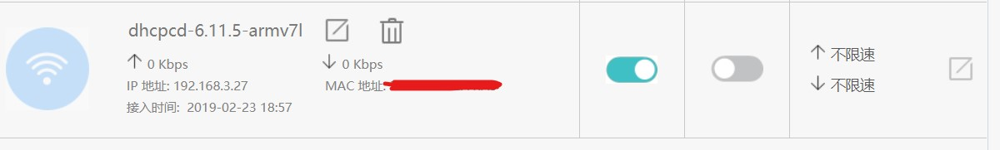
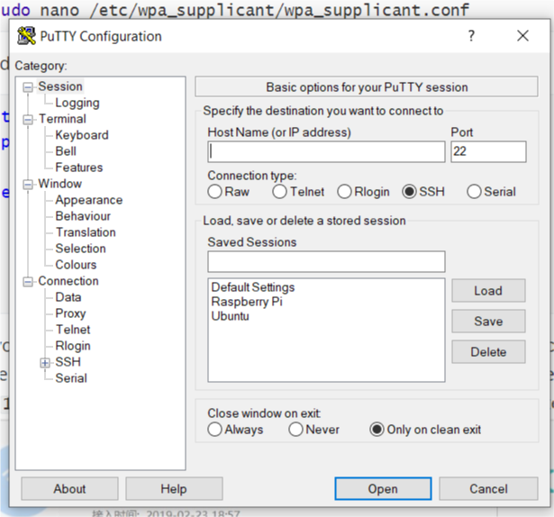

### Hands-On
  This morning I finally received my Raspberry Pi, after an eight-day-long delivery. Raspberry Pi 3B+, released in 2018, as is said, is more powerful than its predecessor. The first step after opening the box is to add two head sinks on the chip. The CPU doesn't need one although its performance has been greatly improved, for it already has one. The given box has no reserved space for GPIO pins, which make it impossible to use it with GPIO peripherals. Therefore, my trick is that I installed a half of the box opposite down like what's shown below.   



### Setup
  I planed to run Windows 10 IoT at first, but finally I decided to use Raspbian as the support for 3B+ has not been officially released. The preview version is buggy and what's worse, it can't support the on-board Wi-Fi.  

  As for setup, convenient as it is generally, there's a big obstacle that I don't have either a network cable or a set of keyboard and mouse. Moreover, my main PC runs Windows, which make the process more complicated.  

  For a headless setup, we need two computers if your main computer runs Windows. As we often do for Pi on Windows, I format the micro SD card and write the Raspbian image with SD Card Formatter from Tuxera Inc. and Rufus. Then, the step is a bit different than common. After mounting the card on a **Linux computer**, edit the file located in `/etc/wpa_supplicant/wpa_supplicant.conf` . For example, we use nano.  

```shell
sudo nano /etc/wpa_supplicant/wpa_supplicant.conf
```

And append a network section like below: 
```shell
ctrl_interface=DIR=/var/run/wpa_supplicant GROUP=netdev
update_config=1

network={
        ssid="Your wifi's SSID"
        psk="Password"
        key_mgmt=WPA-PSK
}
```

If you are living in China, don't forget a `country=CN` before the network section.
Then insert the card, whose slot should be in **the other end** of USBs on the board, and power on the Pi. When the red light is on and the green light is off, you can notice a new device in your router's management page, which is often `192.168.1.1` or `192.168.3.1`. My Pi shows as a **dhcpcd-6.11.5-armv7l** in the router's management page with the IP shown in the screenshot.  



  With the IP address shown, we can easily connect to the Pi by any ssh tools. For example, putty.  



### Login and Have Fun
  As a Raspberry Pi denies a remote connection to the `root` user, we should login with `pi` user and the default password is `raspberry`. The connection should be established well now and you can do anything with this tiny Linux device. Have fun!  

### What's Next
  In the next passage I am going to control a LED matrix with GPIO pins. I will write a program in C++ or Python3 to control the MAX7219 module.  

### Reference
1. [How to set up Raspberry Pi without a monitor?](https://raspberrypi.stackexchange.com/questions/14611/how-to-set-up-raspberry-pi-without-a-monitor)
2. [树莓派 Raspberry Pi 3 无显示器安装](https://zhuanlan.zhihu.com/p/20794478)
3. [Troubleshooting, Raspberry Pi 3B+ booting issues
](https://docs.microsoft.com/en-us/windows/iot-core/troubleshooting)
